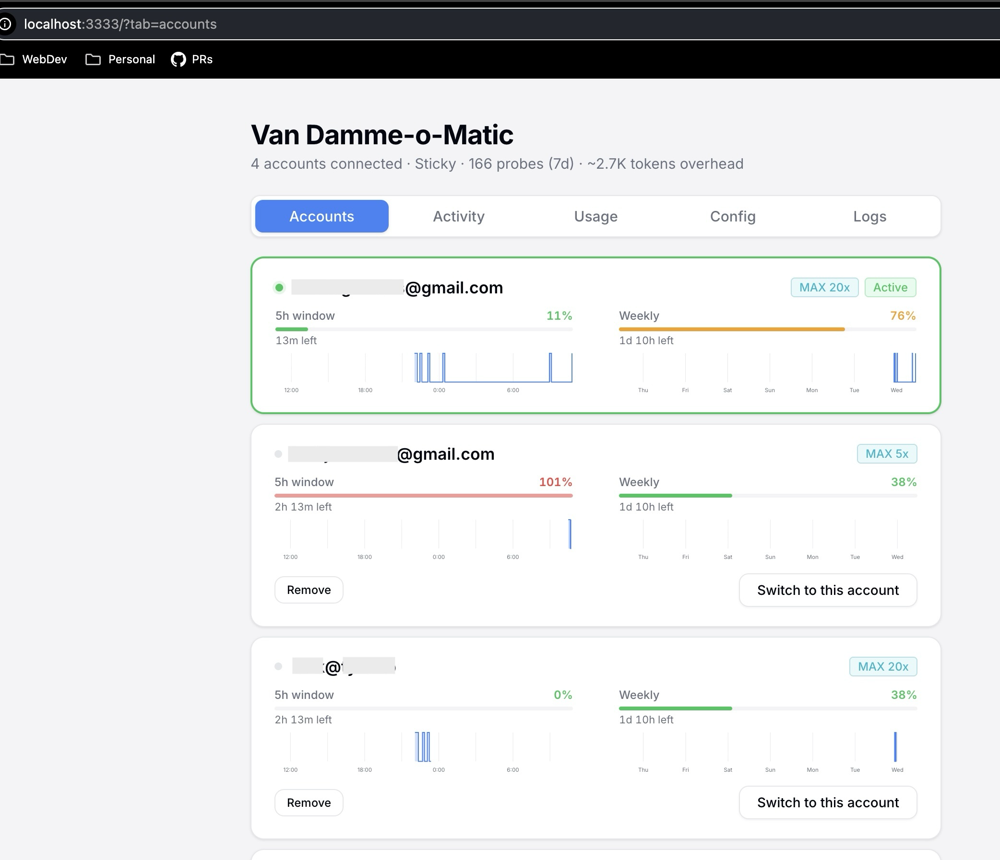

# Van Damme-o-Matic


---

## Why This Exists / Who Is This For

You don't sleep. Your Claude Code sessions run 24/7 in the background while you're nowhere near a keyboard — connected over hotspot, dispatched from your phone, scheduled overnight. While you're in line at the DMV your machine's doing roundhouse kicks, and then, ..., you're rate limited. Session dead. Work stopped.

What does Anthropic want you to do? Log in again. Through their slow, annoying UI. Click click click wait click. Meanwhile your autonomous agent is sitting there like a DMV sloth, doing absolutely nothing. Valuable vibe code minutes are being wasted...

**No. Absolutely not.**

Jean-Claude's on automatic mode from now on.

Van Damme-o-Matic does the splits across multiple accounts so you never have to. It auto-switches on rate limits, auto-refreshes expiring tokens, and keeps your sessions alive while you're nowhere near a keyboard. NEVER EVER get bogged down because you need to log in to a new account through Anthropic's slow annoying UI again.

- **Unattended / overnight power users** — your machine works while you don't
- **People running multiple Claude Code sessions**  - spread the load, never hit a wall
- **Anyone who refuses to babysit token expiry**  - tokens refresh themselves, accounts rotate automatically
- **Night owls, insomniacs, and the simply relentless**  - your AI doesn't sleep and neither should your account management

---



## Install

```bash
git clone https://github.com/Emasoft/claude-acct-switcher.git
cd claude-acct-switcher
./install.sh
```

Restart your terminal. Done. The proxy auto-starts on new shells.

**Requirements:** macOS, Node.js 18+, python3, Claude Code CLI.

**First-time Keychain prompt:** the first time `vdm` reads or writes the macOS Keychain entry it created, macOS pops a system dialog: *"vdm wants to use your confidential information stored in 'Claude Code-credentials'..."*. Click **Always Allow** to skip the prompt for future reads — otherwise you'll see one prompt per Keychain operation. This happens once per saved account.

**Heads-up — `ANTHROPIC_BASE_URL` is set globally.** The install snippet exports `ANTHROPIC_BASE_URL=http://localhost:3334` in your shell rc. This redirects **every** Anthropic SDK on your machine through vdm — Claude Code, the `anthropic` Python SDK, the `@anthropic-ai/sdk` JS package, LangChain `ChatAnthropic`, and any other tool that respects the standard env var. If the dashboard is down (laptop closed, port collision, fresh shell that didn't auto-start it), every Anthropic SDK call gets `ECONNREFUSED`. Run `./uninstall.sh` if you need to surgically remove this.

### Upgrade

```bash
vdm upgrade
```

Fetches the latest release, auto-installs hooks, and restarts the dashboard.

## Usage

Accounts are auto-discovered — just log in:

```bash
claude login    # account A
claude login    # account B — that's it
```

### CLI (`vdm`)

```
vdm list                    List accounts
vdm switch [name|--auto]    Switch account (interactive if no name; --auto picks next available)
vdm add <name>              Save the current Keychain credentials under <name>
vdm remove <name>           Remove account (refuses to remove the active account)
vdm status                  Current account + settings
vdm config [key] [on|off]   View/toggle settings
vdm dashboard [start|stop]  Dashboard control
vdm hooks                   Re-install Claude Code + git hooks (idempotent)
vdm logs [filter]           Stream live proxy logs
vdm tokens [options]        Show token usage
vdm prefs [name [key val]]  View / set per-account preferences (e.g. exclude on/off)
vdm upgrade                 Update to latest version
```

`vdm add` is mostly a fallback for headless / CI flows — accounts are auto-discovered the moment the proxy sees a request from a new token, so most users never need it.

### Slash commands

`install.sh` drops user-level slash commands into `~/.claude/commands/` so any Claude Code session can call them directly.

| Command | Effect |
|---------|--------|
| `/vdm-switch` | Picks the next available saved profile via the dashboard's current rotation strategy and switches to it. Equivalent to `vdm switch --auto` — bypasses the interactive picker, useful for unattended sessions. |

### Dashboard

`http://localhost:3333` — accounts, rate limits, token usage, activity log.

#### Tokens Tab

Per-session token usage tracking with breakdowns by model, repo, branch, and time range.

- **Filter row** — repo, branch, model, and time range (1d/7d/30d/90d)
- **Summary stats** — total tokens, input, output, requests at a glance
- **Daily stacked bar chart** — per-model colored segments with hover tooltips
- **Model breakdown** — input/output split with proportional bars
- **Repo/branch breakdown** — sorted by total tokens, with per-model detail

Token usage is tracked via Claude Code hooks and attributed to the correct git repo and branch — including worktrees. vdm subscribes to the full lifecycle: `UserPromptSubmit` to anchor each turn, `Stop`/`StopFailure`/`SubagentStop`/`SessionEnd` to flush totals, plus `SubagentStart` (parent attribution derived from the documented `transcript_path` layout — the spec doesn't carry parent_session_id in the payload), `PreCompact`/`PostCompact` so input-token math survives auto-compaction, `CwdChanged` so branch attribution stays fresh when a session `cd`s between turns, plus `WorktreeCreate`/`WorktreeRemove`/`TaskCreated`/`TaskCompleted`/`TeammateIdle` for full agent-team coverage. `Notification` triggers an immediate keychain re-read on `auth_success` so account rotation happens in milliseconds instead of waiting for the cache to expire. `ConfigChange` detects external rewrites of `~/.claude/settings.json` (devcontainer rebuild, another tool installing hooks) so users notice when vdm's hook block has been stomped. `UserPromptExpansion` logs `/skill-name` and `@`-mention expansions in the activity feed. An opt-in `PostToolBatch` hook gives per-tool attribution (a "Tool Breakdown" panel in the dashboard) when you set `perToolAttribution: true` in `config.json`.

**Cost estimation** uses Anthropic's published rates per generation (Opus 4.5/4.6/4.7, Sonnet 4.5/4.6/4.7, Haiku 4.5/4.6) including cache token rates (1.25× for cache creation, 0.10× for cache reads). Unknown models log to the activity feed on first occurrence so the rate table can be kept current — verify against `https://claude.com/pricing` after Anthropic releases new generations.

#### Commit Token Trailers

When enabled, a `prepare-commit-msg` git hook appends a `Token-Usage:` trailer to each commit message showing the tokens consumed since the previous commit. This is **disabled by default**.

To enable:

```bash
vdm config commit-tokens on
```

Example commit message:

```
Fix login validation bug

Token-Usage: 12,345 tokens (claude-sonnet-4-20250514)
```

The hook queries the dashboard for usage data and silently skips the trailer if the dashboard is unreachable or the setting is off. Merge, squash, and amend commits are always skipped. After changing this setting, run `vdm hooks` to reinstall the hook.

### Settings

```bash
vdm config proxy on|off           # Token-swapping proxy
vdm config autoswitch on|off      # Auto-switch on 429/401
vdm config rotation <strategy>    # sticky|conserve|round-robin|spread|drain-first
vdm config interval <minutes>     # Round-robin timer
vdm config serialize on|off       # Serialize proxy requests
vdm config serialize-delay <ms>   # Serialization delay
vdm config commit-tokens on|off  # Token-Usage trailer in commits
```

### Rotation Strategies

| Strategy | Behavior |
|----------|----------|
| **Conserve** (default) | Drain accounts that already have an active 5h window first, keep dormant accounts dormant |
| **Sticky** | Stay on the current account, only switch on rate-limit / auth-failure |
| **Round-robin** | Rotate every N minutes (set with `vdm config interval <minutes>`) |
| **Spread** | Always pick lowest utilization |
| **Drain first** | Use highest 5hr utilization first |

### Per-account preferences

Each saved account can opt out of the auto-switch pool independently of the global rotation strategy. Useful when you want to keep an account around (so it doesn't get auto-discovered again next `claude login`) but never have vdm rotate to it automatically — e.g. a personal account on a work-only laptop, or a low-quota account you want to drain manually.

**Toggle from the dashboard:** every account card has an "Exclude from auto-switch" checkbox. The card gets a grey `excluded` badge when on.

**Toggle from the CLI:**

```bash
vdm prefs                              # list every account's prefs
vdm prefs work-account                 # show one account's prefs
vdm prefs work-account exclude on      # opt out of auto-switch
vdm prefs work-account exclude off     # opt back in
```

Excluded accounts are skipped by every auto-pick path (`pickByStrategy`, `pickConserve`, `pickDrainFirst`, `pickAnyUntried`). Manual switches via `vdm switch <name>` or the dashboard's per-card "Switch to this account" button bypass the filter and still work — the flag means "exclude from auto", not "lock out entirely." If the currently-active account is excluded but still healthy, vdm leaves it active (no force-rotate-away); only when it becomes rate-limited or expired does the filter kick in to pick a different account.

## How It Works

```
Claude Code  ──ANTHROPIC_BASE_URL──>  Local Proxy (:3334)  ──>  api.anthropic.com
                                          |
                                          |-- Picks account per rotation strategy
                                          |-- Swaps Authorization header
                                          |-- On 429 → retries with next account
                                          |-- On 401 → refreshes token, then switches
                                          |-- On 400 → multi-layer recovery (4 strategies)
                                          |-- Background token refresh (every 5 min)
                                          |-- Passthrough fallback if all recovery fails
                                          '-- Circuit breaker auto-disables on repeated failures
```

All credentials live in the macOS Keychain. The active account sits at the canonical `Claude Code-credentials` entry that Claude Code itself reads on every request. Saved-but-inactive accounts sit at `vdm-account-<name>` entries (one per profile, encrypted at rest by macOS). On 429, the proxy reads the next saved entry and writes its blob to `Claude Code-credentials` — Claude Code picks up the change on its next API call. The keychain *is* the IPC; there is no separate state to keep in sync.

> **Caveat — migrating from earlier versions.** vdm < 2.x stored saved profiles as plaintext `accounts/<name>.json` files. On first run after upgrade, both the dashboard and `vdm` CLI migrate any leftover JSON files into matching keychain entries (write keychain first, delete file only on success — interrupted migrations re-run cleanly). If the keychain write succeeds but the file delete fails (rare: read-only filesystem, file in use, etc.), `vdm` logs an error telling you to manually delete the leftover file. Until that file is deleted the plaintext OAuth token is still on disk. A clean install of any 2.x or later release never writes such files.

Account labels (typically the account email) live as plaintext sibling files at `~/.claude/account-switcher/accounts/<name>.label`. They contain no token material but DO contain whatever string vdm derives from the upstream `/v1/oauth/profile` endpoint — usually an email address. State files written by the dashboard are mode 0o600 since the security-hardening commit; pre-existing files from older versions inherit their original mode (run `chmod 600 ~/.claude/account-switcher/*.json ~/.claude/account-switcher/accounts/*.label` once if you upgraded across that boundary).

### Proxy Resilience

The proxy is designed to never kill your Claude Code sessions, even when things go wrong:

**Passthrough fallback** — When all proxy recovery strategies fail (expired tokens, network errors, auth failures), the request is forwarded with the original client auth header. This lets Claude Code reach the real API and trigger its own re-auth flow, instead of receiving an opaque error that permanently kills the session.

**Circuit breaker** — After 3 consecutive total failures, the proxy auto-disables into passthrough mode for 2 minutes. All requests go straight to Anthropic with the client's own auth. After the cooldown, proxy mode is re-engaged automatically.

**400 error recovery** — When the API returns 400 (which can mean bad tokens, expired OAuth, or malformed headers), four escalating strategies are tried:

1. Bulk token refresh — force-refresh all account tokens in parallel
2. Single token refresh — refresh the failing account
3. Account switch — try a different account
4. Minimal headers retry — strip all forwarded headers, retry with essentials only

**Wake-from-sleep refresh** — After laptop sleep, all tokens may expire simultaneously. The next periodic `refreshSweep` (5-minute timer) fans out via `Promise.allSettled`, so N expired tokens refresh in parallel (bounded by the upstream OAuth concurrency cap of 3) instead of serially. A configurable request deadline prevents indefinite hangs (default 10 min, see `CSW_REQUEST_DEADLINE_MS`).

**Per-account stream throttling** — Up to N concurrent streams per bearer token (default 8, env: `CSW_MAX_INFLIGHT_PER_ACCOUNT`); excess requests queue. The cap is enforced for the **full SSE stream lifetime**, not just until headers arrive — so 20 Claude Code instances on one account don't all burst on Anthropic at once and trigger anti-abuse heuristics.

**Server-vs-plan 429 distinction** — When Anthropic itself is overloaded (`error.type: "overloaded_error"`), the proxy passes the 429 through without rotating accounts. Rotation only helps for plan-side throttle (`rate_limit_error`), where each account has an independent budget.

### Worktree Support

Sessions running in git worktrees are correctly grouped with the parent repo in the dashboard and token tracking. The proxy resolves the main repo root via `--git-common-dir` and re-reads the checked-out branch on every prompt.

## Limitations / What Disables vdm

vdm sits between Claude Code and Anthropic via `ANTHROPIC_BASE_URL`. There are **seven external conditions** that bypass it — `install.sh` warns about the first two at install time:

1. **Auth env vars set** — `ANTHROPIC_API_KEY`, `ANTHROPIC_AUTH_TOKEN`, `ANTHROPIC_OAUTH_TOKEN`, `CLAUDE_CODE_OAUTH_TOKEN`, `CLAUDE_CODE_OAUTH_REFRESH_TOKEN`. Claude Code reads these BEFORE the keychain → vdm's account rotation becomes a no-op (proxy still forwards traffic, but the active account is fixed).
2. **Cloud-provider env vars** — `CLAUDE_CODE_USE_BEDROCK`/`USE_VERTEX`/`USE_FOUNDRY`/`USE_MANTLE`. Routes Claude Code to a non-Anthropic backend → proxy entirely bypassed.
3. **`auto` permission mode** — Anthropic's spec says auto mode is "not available with Custom API endpoints via ANTHROPIC_BASE_URL". vdm users must use `default` / `acceptEdits` / `plan` / `bypassPermissions` instead.
4. **`claude --bare`** — bare mode skips ALL hook auto-discovery, so vdm hooks don't fire and token attribution is silently absent for those scripted runs. (The proxy may still see traffic if the user supplies `ANTHROPIC_API_KEY`, but tracking is gone.)
5. **Server-managed settings** — vdm's `ANTHROPIC_BASE_URL` setting bypasses Anthropic's server-managed-settings policy as a side effect. Enterprise admins should know that running vdm subverts their managed-settings deployment.
6. **`allowManagedHooksOnly: true`** in managed settings — every user-level hook is silently dropped at session start. Proxy keeps working; token tracking, commit trailers, and session boundaries all stop firing. `install-hooks.sh` warns on detection. An admin can unblock by adding `"allowedHttpHookUrls": ["http://localhost:3333/*"]` to managed settings.
7. **`disableAllHooks: true`** in managed settings — same effect, blanket disable.

## Ports

| Port | Service | Env Override |
|------|---------|-------------|
| 3333 | Web Dashboard | `CSW_PORT` |
| 3334 | API Proxy | `CSW_PROXY_PORT` |
| 3335 | OTLP receiver (opt-in, only when `CSW_OTEL_ENABLED=1`) | `CSW_OTLP_PORT` |

All three servers bind to `127.0.0.1` only and now reject any request whose `Host:` header isn't literal `localhost:PORT` / `127.0.0.1:PORT` / `[::1]:PORT` — DNS-rebind defense for malicious local web pages.

## Tuning Knobs (env vars)

The proxy queue + timeouts are tunable for different plans and workloads. All defaults reflect lessons from the audit cycle (the original 45 s deadline + per-account permit released at headers were causing false rate-limits and "Anthropic unresponsive" reports). Set in your shell rc before launching the dashboard:

| Var | Default | What it controls |
|-----|---------|-------------------|
| `CSW_PROXY_TIMEOUT_MS` | 900000 (15 min) | Idle socket timeout per upstream request. Bump if Opus 4 extended thinking produces SSE gaps wider than this. |
| `CSW_REQUEST_DEADLINE_MS` | 600000 (10 min) | Wall-clock cap on a single proxy request (incl. retries). Only checked at retry boundaries — successful first-attempt streams are not affected. |
| `CSW_MAX_INFLIGHT_PER_ACCOUNT` | 8 | Concurrent streams per bearer token. Now actually enforced for the full SSE lifetime. |
| `CSW_MIN_INTERVAL_PER_ACCOUNT_MS` | 100 | Minimum gap (ms) between successive dispatches against one bearer (≈ 10 RPS). |
| `CSW_MAX_PERMIT_WAIT_MS` | 300000 (5 min) | How long a queued request waits for a per-account permit before failing. |
| `CSW_QUEUE_TIMEOUT_MS` | `CSW_REQUEST_DEADLINE_MS` + 60s (660 s) | How long a request waits in the settings-level serialization queue before being rejected with `queue_timeout` 503. MUST be ≥ `CSW_REQUEST_DEADLINE_MS`, otherwise queued requests are rejected before the deadline guard fires (re-introduces the audit B1/G1 regression — token tracking silently breaks). The dashboard logs a warn at startup if the configured value is below the deadline. Set to 0 for instant rejection (test mode). |
| `CSW_OTEL_ENABLED` | `0` | Set to `1` to start the opt-in OTLP/HTTP/JSON receiver on `CSW_OTLP_PORT`. See "Ports" above and the OTLP-receiver section in [CLAUDE.md](CLAUDE.md). |
| `CSW_OTLP_PORT` | `3335` | TCP port the OTLP receiver binds to (when enabled). |
| `CSW_OTEL_BUFFER_MAX` | `5000` | Ring-buffer cap for OTLP logs and metrics (in-memory only; not persisted). |

## Testing

```bash
node --test 'test/*.test.mjs'
```

## Uninstall

```bash
./uninstall.sh
```

The uninstaller stops the dashboard, removes the shell config block, deletes the install dir + symlink, and asks whether to **purge** or **keep** your saved `vdm-account-*` Keychain entries (default: keep — a future re-install picks them up automatically). Your active `Claude Code-credentials` entry is never touched, so Claude Code keeps working with whichever account was last active.

> **What survives uninstall by default.** A small "defensive cleanup" block is added to your shell rc that runs `unset ANTHROPIC_BASE_URL` on every new shell. This prevents stale env-var carry-over from PM2 dumps, parent processes that forked before the original block was removed, and shell snapshots. The block is safe to delete manually after a full reboot. Re-running `install.sh` removes it automatically. Saved Keychain entries (`vdm-account-*`) are kept by default — pass `--purge-keychain` to uninstall.sh to wipe them, or use `purge` answer at the prompt.

## License

[The Unlicense](LICENSE) — public domain.

---


